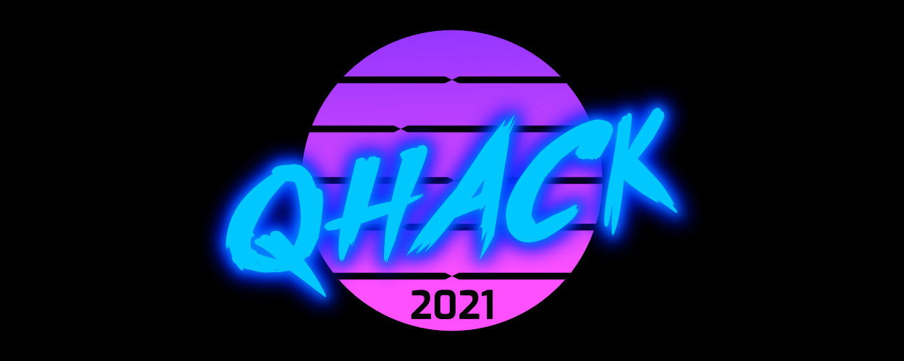
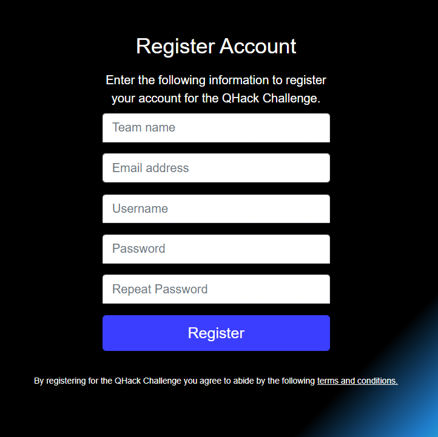
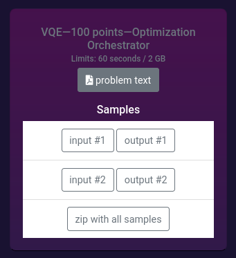
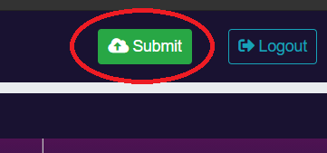
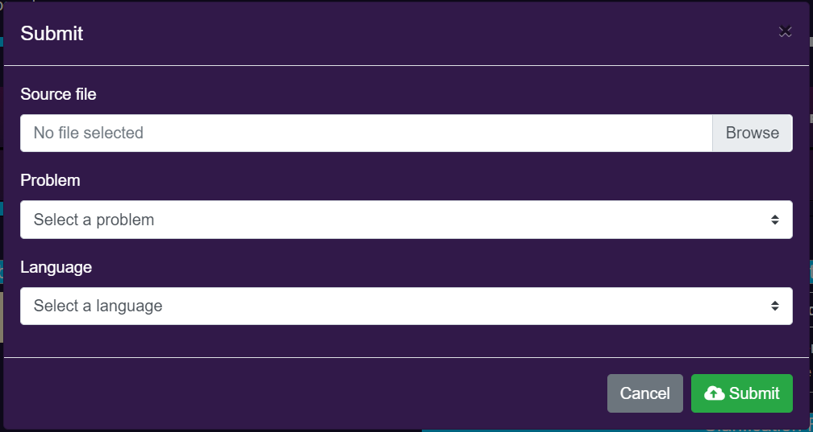

## QML Challenge Leaderboard

For the QML Challenge, you'll work individually or with your teammates on a set of quantum machine learning coding problems. The problems are worth varying numbers of points, depending on difficulty.

You will need to register your Team in order to submit your solutions to the QML Challenges. **There can only be one account associated with each Team**, so if you're a Team of more than one person you must designate someone as Team Captain to register on behalf of the Team and submit the Team's solutions. 

To register, go to https://challenge.qhack.ai/register and enter the following:



1. `Team name` - The name of your Team as it will appear on the Scoreboard.
2. `Email address` - The email address associated with the account.
3. `Username` - The login name for your account. You will use this login name to access your Team page.
4. `Password` - The password for accessing your account.
5. `Repeat Password` - Re-enter your password.


Don't forget to read the [terms and conditions](https://qhack.ai/terms_and_conditions_2021.html) before registering. By registering, you and your teammates agree to abide by the terms and conditions outlined therein.

**IMPORTANT**: Registration for teams will open on *Monday 15 February, 2021*, and there will be a soft closure on *Wednesday 17 February, 2021*. In order to qualify for the $250 in AWS credits, you **must** register your team during this window. However, if you are simply interested in solving the problems at your own pace, you can still register after this date by sending an e-mail to [address](), and the organizers can register you manually. 

### Where to find the problems

All of the problem can be found in the [Challenge portal](https://challenge.qhack.ai/problems). 
Each problem appears in its own card:



Because the challenge solutions will be judged by supplying inputs and comparing the outputs to the expected responses, we've provided templates within *[this GitHub repo](https://github.com/XanaduAI/QHack/tree/main/QML_Challenges)* for every problem. These templates will handle the input/output part of the submission for you. The templates also contain a significant amount of supporting code, particularly for the entry-level questions, so it is strongly advised to base your solutions on the templates rather than attempt to write them from scratch.

### Problem format

The Challenge problems are divided into 4 categories: 

- Simple Circuits
- Quantum Gradients
- Circuit Training
- Variational Quantum Eigensolver (VQE)

Each category contains 3 problems worth differing amounts of points. The "Simple Circuits" problem set contains questions valued at 20, 30, and 50 points. This category is intended primarily as a tutorial so you can get used to the submission process, as well as learn the basics of [PennyLane](https://pennylane.ai), the software library in which all the problems are written. The other three categories have problems valued at 100, 200, and 500 points. 

**The challenges may be completed in any order** (for true beginners, we recommend starting with the *Simple Circuits* problems before progressing to the more challenging ones). While in some cases solving the lower-valued problems will provide insight into the higher-valued ones, all of the problems are intended to be self-contained and do not require any code or numerical values to be carried forward through a category.

Each problem contains a PDF description that contains:

 - A "Problem Set Overview" that provides some motivation and background about the category as a whole (this is the same across all problems in a category)
 - A "Problem Statement" containing the instructions for the particular problem
 - "Input" and "Output" sections that provide details about the format of input and expected output 
 - The "Acceptance Criteria" which states a tolerance or accuracy that the solution must have, as well as a maximum run time of your solution in the judging system.

### How to test your solutions  

We encourage you to test your solutions in a local environment before submitting them to the judging system.

#### System requirements

All solutions must be compatible with Python 3.7.4. The only external libraries supported are listed in the `requirements.txt` file located in *[this GitHub repo](https://github.com/XanaduAI/QHack)*. We recommend setting up a Python virtual environment where you can install the libraries required for the Challenge problems, to keep as close to the environment that will be used to judge your solutions as possible.

#### Setting up your environment  

We recommend creating a new environment for the purpose of testing your solutions. Some popular tools for setting up environments in Python are [conda](https://docs.conda.io/projects/conda/en/latest/user-guide/install/) environments and [virtualenv](https://docs.python.org/3/tutorial/venv.html). Refer to the package-specific instructions for creating the environment itself. Then, install the required libraries by running

```console
pip install -r requirements.txt
```

#### Testing 

Each problem card on the Challenge webpage contains pairs of files labelled by numbers, e.g., `1.in` and `1.ans`. These are sample input (`#.in`) and output (`#.ans`) pairs for the problem. You may notice that the contents of these files are very long strings, usually floating-point numbers separated by commas. Don't worry about the format of these files—functions for parsing the input data are provided for you in all the [problem templates](https://github.com/XanaduAI/QHack/tree/main/QML_Challenges).

To test your solution, you must send the input data from `#.in`  to your program via `stdin`:

```console
python3 simple_circuits_20.py < 1.in
```

The output displayed after the program finishes should match the contents of the corresponding `#.ans` file either exactly, or to within the tolerance level specified in each problem. 


### How to submit your solutions

To submit your solution:

1. Log into your Team's account at https://challenge.qhack.ai/login with the Username and Password used to register your Team.
2. Click the green "Submit" button in the top right corner: 

3. In the Submit pop-up window: 
  a. Click Browse and find and select your code for submission. 
  b. Click the dropdown under Problem to choose which problem your submitting a solution for. 
  c. Under Language choose Python 3 (only option). 
  d. Click Submit! 


Depending on the problem it can take anywhere from a few seconds to a few minutes to be assessed. In the meantime you should see a new entry under the Submissions section of the Team homepage (lower-left corner) with a `PENDING` result: 


Once the submission has been assessed, the result will be updated. You may need to refresh the page to see the new status: 


#### Submission Outcomes
There are several possible outcomes following a submission:

 - **Correct**—Congratulations! The points are yours.
 - **Wrong Answer**—Some part of your solution is incorrect. Double check that your outputs when run locally match the expected outputs to within the allowed tolerance. 
 - **Run-Error**—Something in your solution caused the assessment process to fail. Double check that you don't have any print statements, imports of additional packages, or other run-time errors.

